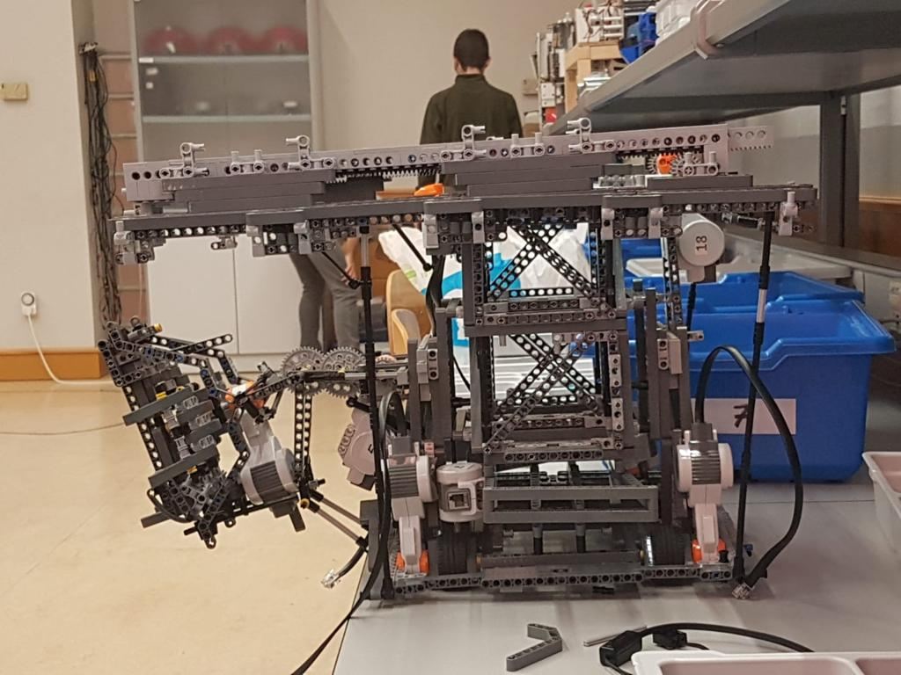

# ROBOTICA-PARA-TODOS

Proyecto hecho para la asignatura transversal de robótica para todos en la UAH

En este proyecto seguimos las reglas de la EUROBOT 2019 resolviendo el circuito con lego NXT

## MOVIMIENTO

## PINZA_Y_BRAZO

## EXPERIMENTO

## RECORRIDO

## CLASIFICACION

## EUROBOT

